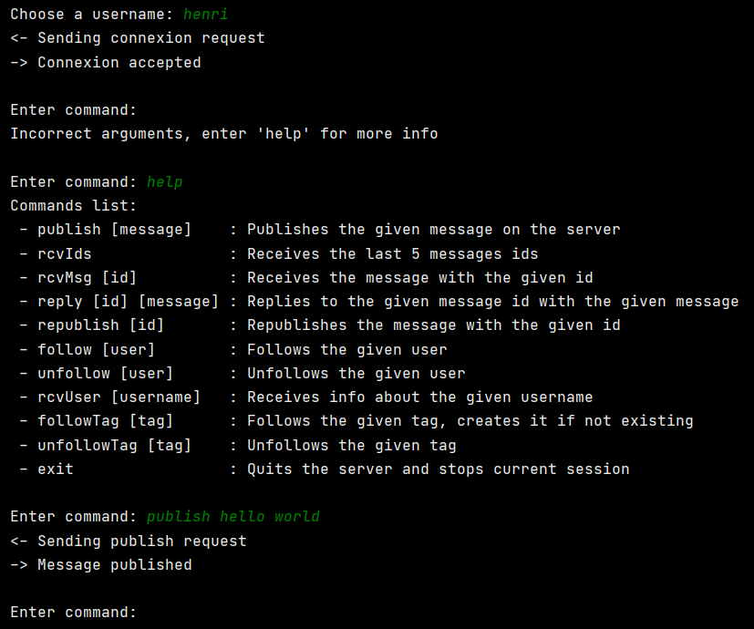
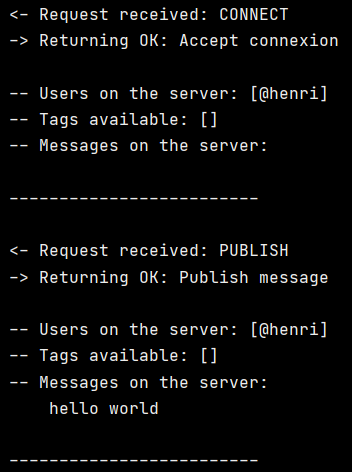
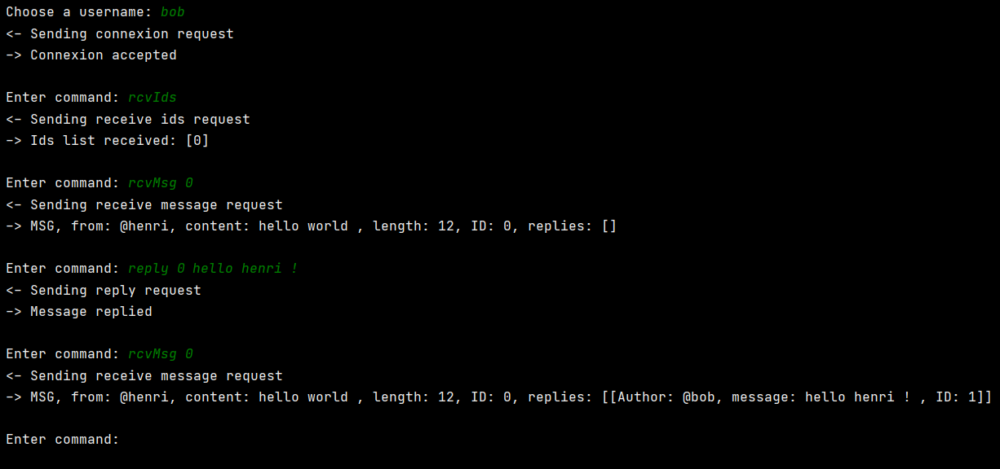
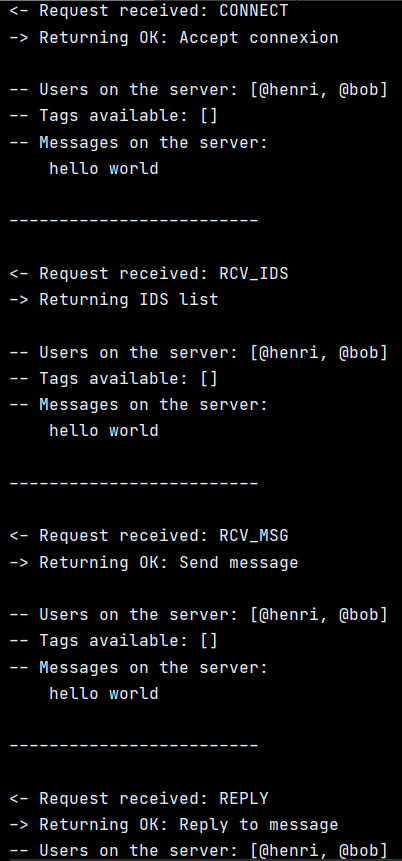

# Microblog

## Description
It's a simulation of an online blog where you can see both the client and the server side, a client can perform some actions related to a classic blog (post messages, replies, follow people, etc...) and the server treats all the requests comming from the client.

Everything run on the terminal with custom made commands (enter help to see all of them) so no GUI.

## Usage
- First you have to run the MicroblogCentral program in a terminal (this is the server), otherwise you will not be able to connect with a user
- On another terminal, run the Main program (this is where you will connect your user)

There isn't any authentication system, it will simply ask you for a username, just enter the name you want.

## Author
Realized by Henrique D.M.M

## Demo images
### henri connects and publish a msg

### server side

### bob connects, check msg, repsond to henri's message

### server side

